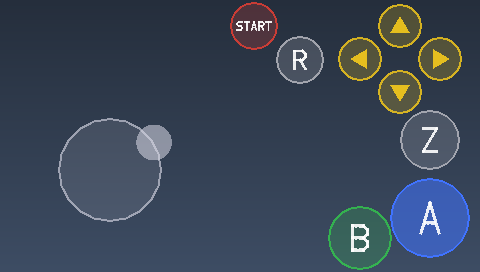

# Super Mario 64 for the Zune HD

A port of [sm64ex](https://github.com/sm64pc/sm64ex) to the Zune HD. It plays (mostly) at full speed with sound, touch controls and saves.

This repository holds no part of the game, and no built game is offered anywhere: you supply
the ROM during the build process.

## What you need

- A **Zune HD** and its USB cable. Only firmware 4.5 has been tested so far.
- A **Super Mario 64 (USA)** ROM dumped from your own cartridge. The checksum needs to be `9bef1128717f958171a4afac3ed78ee2bb4e86ce`, The build checks.
- An **x86-64 Linux** computer with [Docker](https://docs.docker.com/engine/install/) and git,
  6 GB of free disk space, and an internet connection for the first build.

Building and deploying uses Docker; no bare-metal workflow is currently provided.

## Build and install

```sh
git clone https://github.com/rsheldiii/sm64-zune
cd sm64-zune
./sm64zune build path/to/your-rom.z64
./sm64zune deploy
```

The first run takes five to ten minutes: it creates the
build container image, and asks before it downloads the compilers
([what a build downloads](#what-a-build-downloads)).

`deploy` is a separate container that installs the finished
package on the Zune plugged in over USB. Close any app on the Zune first. 

## Playing



Hold three fingers on the screen for two seconds to exit.

## Build flags

| Flag | Values | Default | |
| --- | --- | --- | --- |
| `ZUNE_FRAME_SKIP` | `never`, `sustained`, `always` | `sustained` | What to do when the Zune cannot keep up: slow down like the N64 (`never`), or skip drawing some frames. |
| `ZUNE_TOUCH_BUTTONS` | `hidden`, `outline`, `filled` | `filled` | How the touch controls are drawn. They work the same in every style. |
| `ZUNE_TOUCH_OPACITY` | `10` to `100` | `80` | How strongly they are drawn, in percent. |
| `ZUNE_LOG` | `off`, `on` | `off` | Keep a log and send it to your computer; see [Getting a log](#getting-a-log). |
| `ZUNE_LOG_HOST` | an IPv4 address | this computer | Where the log is sent. |
| `ZUNE_PROFILE` | `off`, `on` | `off` | A profiler, for working on the port. |

Flags are chosen when the game is built:

```sh
./sm64zune build rom.z64 --define ZUNE_TOUCH_BUTTONS=outline --define ZUNE_TOUCH_OPACITY=50
./sm64zune settings        # list build flags and the values the next build would use
```

To keep a flag for every build, put `NAME=VALUE` lines in a file named `settings.local`
next to `sm64zune`.

## Troubleshooting

### `deploy` says "not installed"

Close whatever is running on the Zune, unplug it, plug it back in, wait for its "connected"
screen and run `./sm64zune deploy` again.
`build/logs/deploy.log` has the details. Docker must be able to hand a USB device to a
container; the usual (rootful) Docker can.

### The game closes as soon as it starts

The copy was most likely cut short. Deploy again.

### The game stops with a message

The message names the build and two addresses. On the computer that built it,
`python3 tools/symbolize.py ADDRESS ADDRESS` (Python 3) turns them
into function names. Please open an issue with the message and those names.

### Getting a log

Nothing can read files off a Zune over USB, so the game sends its log over Wi-Fi when you
leave it:

```sh
./sm64zune build rom.z64 --define ZUNE_LOG=on
./sm64zune deploy
./sm64zune logs            # waits for the log; leave it running
```

Unplug the Zune (its Wi-Fi is off while it is on USB), play, and leave the game with three
fingers. The log arrives in `build/logs/zune/`, and a crash in it is printed with function
names. The Zune must be on the same network as the computer, which listens on port 8767
while `./sm64zune logs` runs. If the log cannot be delivered it stays on the Zune and goes
out with the next one.

Logs are uploaded only when you leave with the three-finger gesture. A crash, including
one during startup, cannot upload its log; a later successful run must send it.
The crash message box still needs confirmation on hardware.

### Starting over

`./sm64zune clean` deletes what was built from your ROM;
`./sm64zune clean --all` deletes the downloaded compilers too.

## How it works

- sm64ex's own build extracts the game's assets from your ROM and generates its sources.
- Those sources, [compatibility and performance patches](patches/) and the Zune layer in
  [`platform/`](platform/) are compiled with Microsoft's 2008 ARM compiler under Wine.
- The Zune's graphics driver cannot compile shaders, so the game's shaders are compiled ahead
  of time with NVIDIA's Tegra tools and built into the game.
- The Zune only starts XNA programs, so the package holds OpenZDK's small XNA launcher
  ([`launcher/`](launcher/)), which starts the native game.
- [zune-deploy](https://github.com/gigalasr/zune-deploy) installs the package over USB.

See [docs/porting.md](docs/porting.md) for more.

## What a build downloads

`./sm64zune build` lists these and asks before fetching them into `build/toolchain`. Each
download is checked against a SHA-256 recorded in [`tools/fetch.py`](tools/fetch.py).

| What | From | Size |
| --- | --- | --- |
| Microsoft Visual C++ 2008 ARM compiler: 12 files | Microsoft's Visual Studio 2008 trial ISO; only the two cabinets that hold them are downloaded | 24 MB |
| OpenZDK 4.5 headers and libraries | [openZDK-quick-start-kit](https://github.com/ZuneRedux/openZDK-quick-start-kit) | 6 MB |
| NVIDIA `cgc` and `shaderfix` | NVIDIA's Tegra 250 Windows CE 6 platform pack | 36 MB |
| Khronos EGL and OpenGL ES 2 headers | [Khronos registries](https://github.com/KhronosGroup) | 0.4 MB |

The container images hold Debian with Wine and build tools, and zune-deploy with the Zune
runtime files it carries. sm64ex is a git submodule, which `build` fetches.

## Licence and disclaimers

This project's own code is under the MIT licence. The renderer backend derives from
[Fast3D](https://github.com/Emill/n64-fast3d-engine), whose licence forbids distributing a
built game that contains assets you have no right to distribute. [LICENSE](LICENSE) has the
terms for every part.

sm64-zune is not affiliated with, endorsed by or sponsored by Nintendo or Microsoft. Super
Mario 64 is Nintendo's; Zune is Microsoft's. Do not ask for a ROM or a built game here.

The game runs as native code on your Zune by way of OpenZDK, which Microsoft never
supported. Nothing in the Zune's firmware is changed, but you use this at your own risk.

## Credits

- The [Super Mario 64 decompilation](https://github.com/n64decomp/sm64), and the
  [sm64-port](https://github.com/sm64-port/sm64-port) and
  [sm64ex](https://github.com/sm64pc/sm64ex) contributors.
- Emill and MaikelChan for the Fast3D renderer.
- itsnotabigtruck and the OpenZDK team for native code on the Zune HD, and
  [ZuneRedux](https://github.com/ZuneRedux) for keeping the kit available.
- gigalasr for [zune-deploy](https://github.com/gigalasr/zune-deploy).
